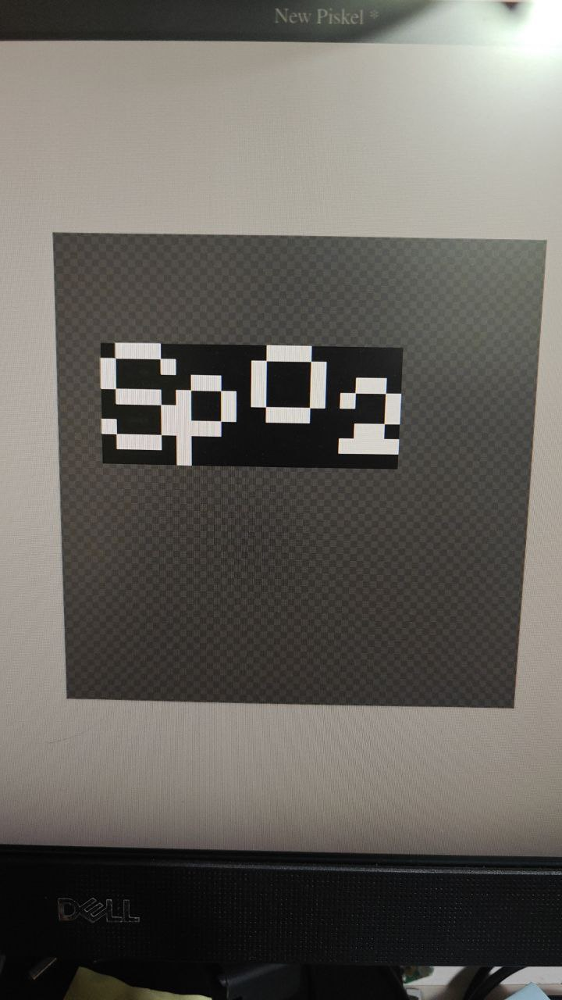
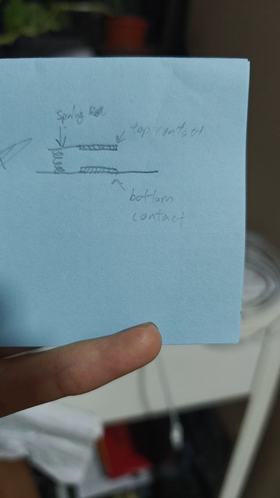

# NUS BN2111 W3 Group 1

This whole project couldn't be done so well without this previous project
<a href="https://github.com/WorldFamousElectronics/PulseSensor_Amped_Arduino">PulseSensor Project</a>

### After the activity:
we found out a few things such as the fact that
1. the wires are loose, causing communication issues btwn Arduino and LCD
2. we will need to change the code a bit to handle the fact that QS is not a good metric to tell when a finger is detected or not

### Solution to problem 1
Buy the wires :(((

### Solution to problem 2
So I read thru the Interrupt.ino code afterwards and I found out that they have already made an arbitrary decision to reset the values after 2.5s without a heartbeat, so I can just use the fact that firstBeat is reset to true to make display when a heartbeat is detected

## Adding personality to our final project
1. I feel like adding emojis to the display is a good way to show the personality of our project
Like this SpO2 emoji

2. I way thinking of adding a graph at the very bottom of the screen just cause it might look very cool
3. The last thing I was thinking of was, since we are making a big cardboard thing, why not make a mechanical button using a spring and 2 aluminium foil contacts
Something like this:

4. **Maybe Maybe** hook up to a Phone and display the Signal graph

## Speed ups done
1. Using bit operations
2. Using a function pointer (*signalToHeight), to not bog the Arduino down with if else branches
3. Clearing graph with memset which should be faster than using a for loop to set each byte
